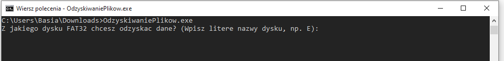
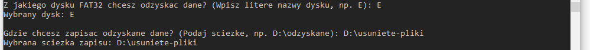
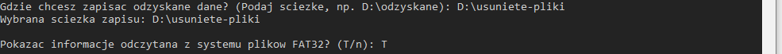
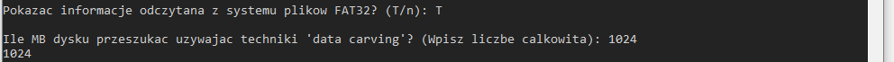
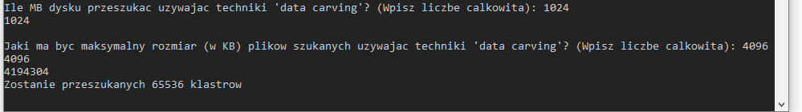
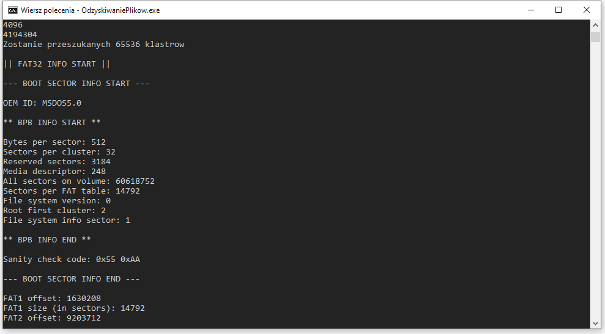
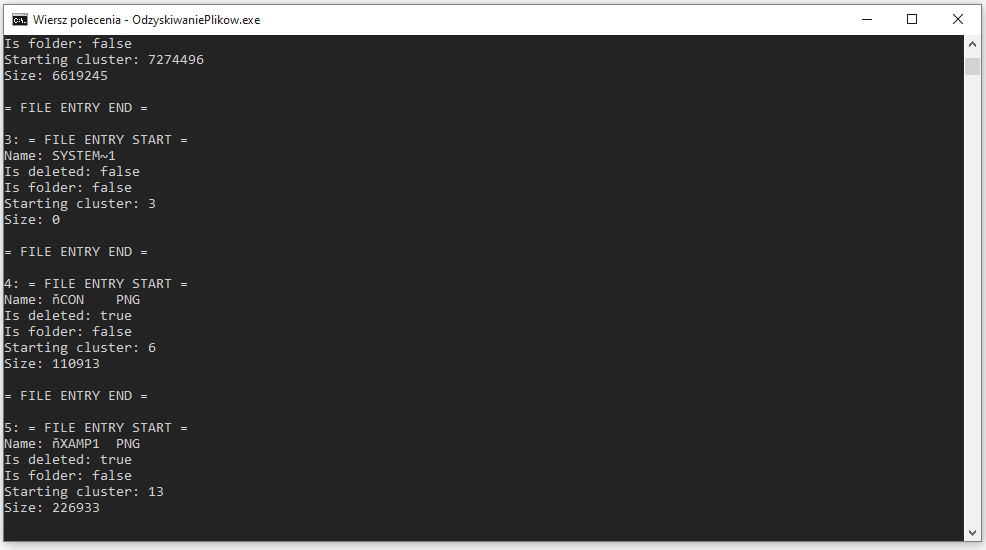
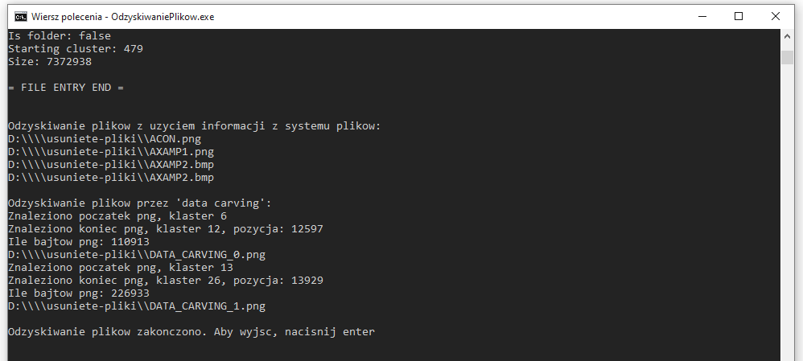
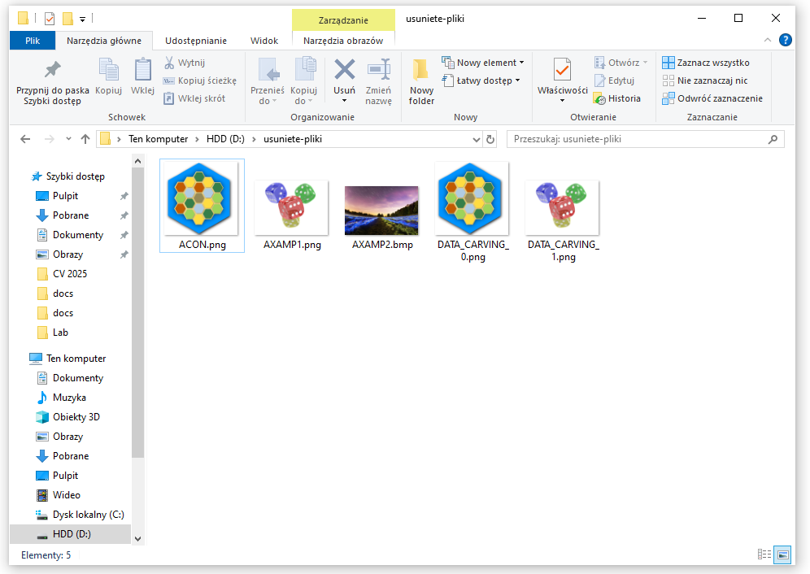

# os-projekt

## Spis treści

1. [Opis](#opis)
2. [Instrukcja uruchamiania](#instrukcja-uruchamiania)
3. [Menu aplikacji](#menu-aplikacji)
4. [Formatowanie pendrive'a do testów](#formatowanie-pendrive'a-do-testów)
4. [Znane błędy](#znane-błędy)

## Opis

Projekt z Oprogramowania Systemowego w edycji 2022/23 - odzyskiwanie usuniętych plików w systemie plików FAT32. Pliki można odzyskiwać poprzez  korzystanie z informacji pozostałych w systemie plików lub *data carving* (druga opcja jest dostępna tylko dla plików PNG).

W opcji odzyskiwania plików z użyciem informacji pozostałej w systemie plików program zakłada, że pliki nie były sfragmentowane i odzyskuje dane z kolejnych klastrów pamięci, aż do klastra, który byłby ostatnim, jeśli plik o odczytanym rozmiarze zostałby zapisany ciągiem.

Opcja odzyskiwania plików przez *data carving* jest jedynie pokazowa (na cele projektu akademickiego) i odzyskuje tylko pliki `.png`, na podstawie znalezionej na dysku sygnatury początkowej tego typu plików. Należy w niej podać limit rozmiaru, jakiej wielkości plików ma szukać, żeby przyspieszyć działanie programu, jeśli szukamy małych plików.


## Instrukcja uruchamiania

Aby skorzystać z narzędzia, można pobrać gotowy plik wykonywalny aplikacji, najnowsze wydanie dostępne [tutaj](./../../releases), lub samodzielnie skompilować projekt, np. otwierając plik projektu `OdzyskiwaniePlikow/OdzyskiwaniePlikow.sln` w Visual Studio i naciskając F5.

## Menu aplikacji

Aplikacja po uruchomieniu prosi o wprowadzenie kilku parametrów wejściowych:

1. Litera dysku, pod jaką zamontowany jest pendrive, z którego chcemy odzyskać dane:



2. Ścieżka pod jaką chcemy zapisać odzyskane dane:



**Uwaga:** Trzeba podać ścieżkę na inny dysk, niż ten z którego odzyskujemy dane - w przeciwnym wypadku nieodwracalanie nadpisalibyśmy część danych, które próbujemy odzyskać.

3. Pytanie, czy chcemy zobaczyć jak wyglądają dane systemu FAT32, które odczytał program - opcja dla zainteresowanych jak wygląda system plików. Jeżeli chcemy tylko odzyskać dane, można wybrać 'n'.



4. Parametr 1 dla odzyskiwania metodą data carving - limit obszaru, jaki chcemy przeszukać na pendrive (w MB):



5. Parametr 2 dla odzyskiwania metodą data carving - limit rozmiaru pojedynczego pliku PNG, jakiego szukamy (w KB):



**Efekty działania aplikacji**

Jeśli wybraliśmy opcję wyświetlenia informacji z systemu plików, zobaczymy dodatkowe informacje w poniższej formie:





W obu przypadkach natomiast, zobaczymy jakie pliki program odnalazł i odzyskał używając obu technik odzyskiwania plików:



W folderze, który podaliśmy jako miejsce zapisania wyników, pojawią się odzyskane pliki:




## Formatowanie pendrive'a do testów

Jeśli chcesz tylko przetestować aplikację, możesz sformatować swój pendrive, aby był całkowicie czysty, a następnie zapisać i usunąć z niego tylko kilka plików. Aplikacja testowana przy użyciu pendrive, na którym wcześniej było dużo danych, mogłaby odzyskać sporo plików, które niepotrzebnie zajęłyby dużo miejsca. Użycie pustego pendrive jest również okazją dla zainteresowanych tematem do zobaczenia jak wygląda system plików, kiedy nic w nim nie ma :)

**Uwaga:** Należy się upewnić przed formatowaniem, że z pendrive, którego chcemy wyczyścić, skopiowaliśmy już wszystkie dane, które chcemy zachować - podczas formatowania wszystko jest usuwane.

Formatowanie można wykonać:
- w sposób szybki, który wgrywa tylko nowy system plików, ale nie zamazuje samych danych,
- lub w sposób pełny, który również wypełnia zerami miejsce na dane. Ta opcja trwa dłuższą chwilę - np. dla pendrive 32 GB może zająć ok. 15 min.

Aby sformatować pendrive, w systemie Windows możemy kliknąć na niego prawym przyciskiem myszy i wybrać opcję `Formatuj...`. Domyślnie zaznaczona jest szybka opcja, odznaczając ją powinniśmy sformatować pendrive w sposób pełny. 

Można również wykonać formatowanie używając narzędzia CMD:
- szybki format - zamiast DISK_LETTER należy wpisać literę, pod jaką zamontowany jest pendrive, np. `E:`. Opcja `/fs` określa system plików, jaki ma zostać wgrany na pendrive, a opcja `/q`, że chcemy wykonać tylko szybki format. Więcej o poleceniu cmd `format` można poczytać [tutaj](https://learn.microsoft.com/en-us/windows-server/administration/windows-commands/format).

```
> format DISK_LETTER /fs:FAT32 /q
```
- pełny format - różni się od powyższego polecenia tylko opcją `/p` zamiast `/q`. Opcja `/p` sprawia, że cały pendrive zostanie wyzerowany.

```
> format DISK_LETTER /fs:FAT32 /p:0
```

**Uwaga:** Jeśli któryś sposób formatowania się nie powiedzie i sprawi, że pendrive nie będzie się chciał otworzyć, zwykle wystarczy zrobić na nim szybki format używając wcześniej opisanej opcji z menu Windowsa, czyli klikając prawym przyciskiem myszy na pendrive i wybierając opcję `Formatuj...`, z zaznaczonym szybkim formatem. Szczęśliwego formatowania! :D

## Znane błędy

Obecnie program jest w wersji beta (ale raczej nie będzie już kontynuowany) i ma kilka błędów:
- nazwy dla odzyskiwanych plików nie są generowane (w opcji odzyskiwania z informacją z systemu plików), tylko za nowy identyfikator pliku przyjmowana jest część prawdziwej nazwy odzyskiwanego pliku (pierwsze 8 znaków) - przez to dość często mogą zdarzać się kolizje w nazwach i np. odzyskany zostanie tylko 1 plik o podobnej nazwie
- lepiej, żeby nazwy odzyskiwanych plików nie przekraczały 8 znaków - w systemie FAT32 długie nazwy, przekraczające ten limit, są zapisywane w inny sposób niż krótkie i program nie w pełni obsługuje takie sytuacje
- program oprócz usuniętych plików, odzyskuje również te, które nie zostały skasowane - niektórzy mogą jednak uznać, że *it's not a bug, it's a feature* ;)